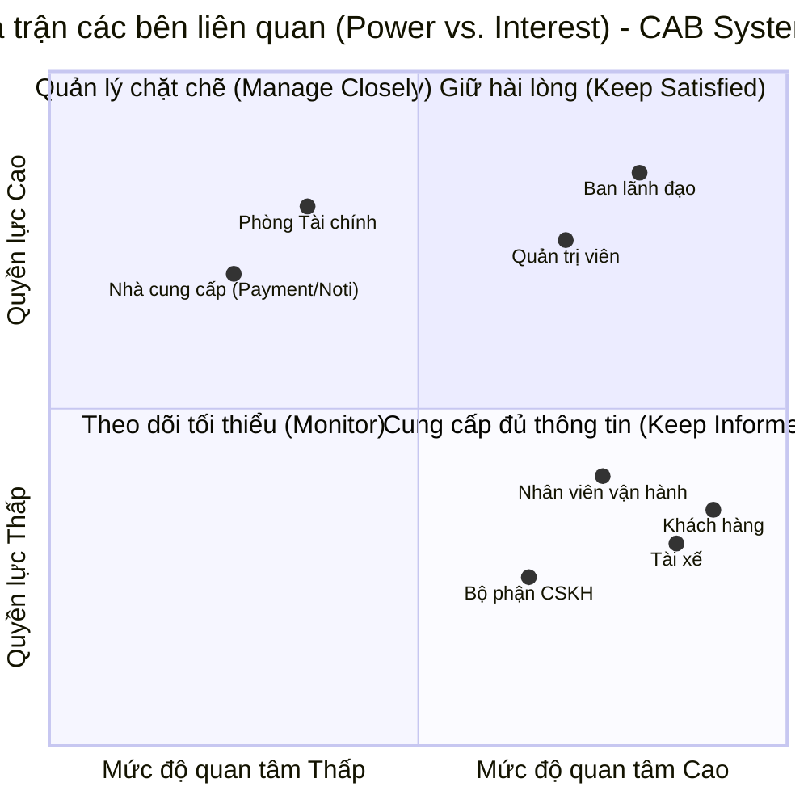

# CAB SYSTEMS

## Vấn đề hiện tại là gì

>Vấn đề của bài toán là Công ty ABC hiện đang gặp nhiều hạn chế trong việc quản lý và vận hành dịch vụ đặt xe. Quy trình đặt xe và phân công tài xế còn phụ thuộc nhiều vào thao tác thủ công, khiến việc tìm tài xế phù hợp mất thời gian, khó tối ưu và dễ xảy ra sai sót. Khách hàng cũng chưa có khả năng theo dõi đầy đủ trạng thái chuyến đi, thông tin tài xế, thời gian dự kiến đến và kết quả thanh toán. Bên cạnh đó, dữ liệu khách hàng, tài xế, chuyến đi và giao dịch chưa được quản lý tập trung, gây khó khăn cho nhân viên vận hành trong việc giám sát, xử lý sự cố và lập báo cáo. 

>Hệ thống hiện tại cũng chưa đáp ứng tốt yêu cầu mở rộng khi số lượng khách hàng và tài xế tăng lên, đồng thời còn phụ thuộc vào các thành phần như thanh toán và thông báo. Đặc biệt, nhiều quy tắc nghiệp vụ quan trọng như cách tính cước, tiêu chí lựa chọn tài xế, thời gian phản hồi, chính sách hủy chuyến, xử lý thanh toán thất bại và mất kết nối vẫn chưa được xác định rõ. Vì vậy, doanh nghiệp cần xây dựng một nền tảng CAB mới có khả năng tự động hóa toàn bộ quy trình từ đặt xe, tìm và phân công tài xế, theo dõi chuyến đi, tính cước, thanh toán, thông báo đến đánh giá, đồng thời đảm bảo tính bảo mật, ổn định, khả năng mở rộng và linh hoạt để đáp ứng các nhu cầu phát triển trong tương lai.

## Stakeholder của hệ thống
| Stakeholder | Vai trò trong hệ thống |
| :--- | :--- |
| **Khách hàng (Customer)** | Đăng ký tài khoản, đặt xe, theo dõi chuyến đi, thanh toán, xem lịch sử và đánh giá tài xế. |
| **Tài xế (Driver)** | Quản lý hồ sơ, phương tiện, trạng thái hoạt động, nhận/từ chối chuyến và cập nhật tiến trình chuyến đi. |
| **Nhân viên vận hành (Operator)** | Theo dõi chuyến đang diễn ra, quản lý trạng thái tài xế, hỗ trợ xử lý sự cố và tra cứu giao dịch. |
| **Quản trị viên (Administrator)** | Quản lý người dùng, tài xế, phương tiện, phân quyền truy cập và cấu hình hệ thống cốt lõi. |
| **Ban lãnh đạo (Management)** | Theo dõi hiệu quả kinh doanh, xem báo cáo doanh thu, tỷ lệ hoàn thành/hủy chuyến để ra quyết định. |
| **Nhà cung cấp thanh toán (Payment Provider)** | Cung cấp dịch vụ thanh toán điện tử, xử lý giao dịch an toàn mà không lưu trữ dữ liệu nhạy cảm. |
| **Nhà cung cấp thông báo (Notification Provider)** | Cung cấp hạ tầng gửi Push Notification, SMS hoặc Email cho hệ thống. |
| **Bộ phận hỗ trợ khách hàng (Customer Support)** | Xử lý khiếu nại, sự cố chuyến đi, lỗi thanh toán và hỗ trợ người dùng khi cần thiết. |
| **Bộ phận tài chính / kế toán (Finance/Accounting)** | Sử dụng dữ liệu giao dịch và doanh thu để đối soát, kiểm tra tài chính doanh nghiệp. |

## 📊 Ma trận các bên liên quan (Stakeholder Matrix)

## 🏢 Các Đơn vị kinh doanh & Bộ phận (Business Units)

| Tên Business Unit / Bộ phận | Vai trò và Chức năng chính trong hệ thống |
| :--- | :--- |
| **Khối Vận hành (Operations Unit)** | • Quản lý và giám sát toàn bộ hoạt động đặt xe hằng ngày. • Theo dõi trạng thái tài xế, chuyến đi đang diễn ra. • Xử lý các sự cố phát sinh (hủy chuyến, tranh chấp, lỗi điều phối). |
| **Khối Kinh doanh & Phát triển (Business Development Unit)** | • Quản lý chiến lược phát triển mạng lưới khách hàng và tài xế. • Đưa ra các chính sách giá cước, chương trình khuyến mãi, ưu đãi. • Phân tích hiệu quả kinh doanh dựa trên báo cáo doanh thu và tỷ lệ hoàn thành chuyến. |
| **Khối Hỗ trợ Khách hàng / CSKH (Customer Support Unit)** | • Tiếp nhận và giải quyết khiếu nại, thắc mắc từ phía Khách hàng và Tài xế. • Hỗ trợ xử lý các vấn đề liên quan đến thanh toán thất bại, sự cố chuyến đi. |
| **Khối Tài chính - Kế toán (Finance & Accounting Unit)** | • Đối soát giao dịch, dòng tiền giữa hệ thống, tài xế và nhà cung cấp thanh toán. • Kiểm tra doanh thu, chiết khấu hoa hồng và quản lý tài chính doanh nghiệp. |
| **Khối Công nghệ & Quản trị Hệ thống (IT & Admin Unit)** | • Quản trị hệ thống lõi, cấu hình phân quyền và bảo mật dữ liệu. • Quản lý thông tin tài khoản người dùng, tài xế và phương tiện. • Tích hợp các bên thứ ba (Cổng thanh toán, Dịch vụ thông báo). |

## 🎯 Phạm vi dự án (Project Scope - MVP)

Để hệ thống CAB Systems có thể vận hành cơ bản như một nền tảng đặt xe hoàn chỉnh, phạm vi công việc tập trung vào các chức năng cốt lõi sau:

### 1. Phân hệ Khách hàng (Customer App / Web)
- **Đăng ký / Đăng nhập:** Quản lý tài khoản cá nhân qua số điện thoại hoặc email.
- **Đặt xe (Booking):** Nhập điểm đi, điểm đến, hệ thống tính toán quãng đường và ước tính giá cước (Estimated Fare).
- **Phân công & Theo dõi chuyến đi:** Nhận thông tin tài xế được gán, theo dõi vị trí xe thời gian thực (Real-time tracking) trên bản đồ.
- **Thanh toán:** Hỗ trợ thanh toán cơ bản (Tiền mặt hoặc tích hợp cổng thanh toán điện tử).
- **Đánh giá chuyến đi:** Cho điểm và để lại phản hồi cho tài xế sau khi hoàn thành chuyến.

### 2. Phân hệ Tài xế (Driver App)
- **Quản lý trạng thái:** Bật/tắt trạng thái sẵn sàng nhận chuyến (Online/Offline).
- **Nhận hoặc từ chối chuyến:** Nhận thông báo yêu cầu đặt xe từ khách hàng ở gần và xác nhận thực hiện.
- **Cập nhật tiến trình:** Cập nhật các trạng thái của chuyến đi (*Đang đến điểm đón, Đã đón khách, Đã hoàn thành*).
- **Lịch sử thu nhập:** Xem lại danh sách các chuyến xe đã thực hiện và tổng cước thu được.

### 3. Phân hệ Vận hành & Quản trị (Operations & Administrator)
- **Quản lý người dùng:** Duyệt, khóa hoặc mở khóa tài khoản Khách hàng và Tài xế.
- **Giám sát thời gian thực:** Bảng điều khiển (Dashboard) theo dõi các chuyến đi đang diễn ra và vị trí/trạng thái tài xế trên hệ thống.
- **Xử lý sự cố:** Hỗ trợ can thiệp thủ công khi chuyến đi gặp lỗi, hủy chuyến hoặc tranh chấp.
- **Cấu hình hệ thống:** Quản lý các tham số cốt lõi (như công thức tính giá cước cơ bản, bán kính tìm kiếm tài xế).

### 4. Tích hợp hệ thống bên thứ ba (Third-party Integrations)
- **Dịch vụ Bản đồ & Định vị (Maps & Geolocation):** Tính toán tọa độ, chỉ đường và ước tính khoảng cách.
- **Cổng thanh toán (Payment Gateway):** Xử lý giao dịch thanh toán trực tuyến an toàn.
  
## 📋 Yêu cầu nghiệp vụ (Business Requirements)

Các yêu cầu nghiệp vụ cốt lõi dưới đây định nghĩa phạm vi hoạt động của hệ thống CAB Systems (MVP):

### 1. Quản lý Người dùng & Xác thực (User Management & Authentication)
- **BR-01:** Hệ thống phải cho phép Khách hàng đăng ký, đăng nhập và quản lý thông tin cá nhân.
- **BR-02:** Hệ thống phải cho phép Tài xế đăng ký tài khoản, gửi hồ sơ xác thực phương tiện và quản lý trạng thái hoạt động (Online/Offline).
- **BR-03:** Quản trị viên (Administrator) phải có quyền phê duyệt, kích hoạt, tạm khóa hoặc vô hiệu hóa tài khoản của Khách hàng và Tài xế.

### 2. Quản lý Đặt xe & Điều phối (Booking & Dispatching)
- **BR-04:** Khách hàng phải có khả năng nhập điểm đón, điểm đến, xem cước phí ước tính (Estimated Fare) trước khi xác nhận đặt xe.
- **BR-05:** Hệ thống phải tự động tìm kiếm và gửi yêu cầu đặt xe đến tài xế phù hợp ở gần khu vực điểm đón nhất.
- **BR-06:** Tài xế phải có khả năng tiếp nhận hoặc từ chối yêu cầu đặt xe trong một khoảng thời gian quy định.
- **BR-07:** Khách hàng và Tài xế phải có thể cập nhật và theo dõi các trạng thái xuyên suốt của chuyến đi: *Đang tìm tài xế -> Tài xế đang đến -> Đã đón khách -> Hoàn thành chuyến đi (hoặc Hủy chuyến)*.

### 3. Thanh toán & Đối soát (Payment & Settlement)
- **BR-08:** Hệ thống phải hỗ trợ hình thức thanh toán linh hoạt, bao gồm thanh toán bằng tiền mặt và tích hợp cổng thanh toán điện tử.
- **BR-09:** Hệ thống phải ghi nhận lại toàn bộ lịch sử giao dịch và doanh thu của từng chuyến đi để phục vụ công tác đối soát của bộ phận Tài chính - Kế toán.

### 4. Vận hành, Giám sát & Hỗ trợ (Operations, Monitoring & Support)
- **BR-10:** Nhân viên vận hành (Operator) phải có một giao diện trung tâm (Dashboard) để theo dõi trạng thái các chuyến xe đang diễn ra theo thời gian thực.
- **BR-11:** Hệ thống phải hỗ trợ nhân viên vận hành hoặc CSKH can thiệp thủ công (hủy chuyến, xử lý tranh chấp, hỗ trợ sự cố) khi có phát sinh.
- **BR-12:** Ban lãnh đạo (Management) phải có quyền truy cập vào các báo cáo tổng quan về doanh thu, số lượng chuyến hoàn thành và tỷ lệ hủy chuyến để hỗ trợ ra quyết định kinh doanh.

### 5. Tích hợp Dịch vụ bên thứ ba (Third-party Integrations)
- **BR-13:** Hệ thống phải tích hợp dịch vụ bản đồ và định vị để tính toán tọa độ, quãng đường, chỉ đường và ước tính thời gian di chuyển.
- **BR-14:** Hệ thống phải tích hợp dịch vụ thông báo (Push Notification / SMS) để gửi các cập nhật về trạng thái chuyến đi cho Khách hàng và Tài xế.

## ⚙️ Yêu cầu chức năng cốt lõi (Functional Requirements)

Dưới đây là các yêu cầu chi tiết định nghĩa hành vi và tính năng của hệ thống trong luồng đặt xe (Booking & Matching Flow):

### 1. Xác định Vị trí & Định vị Địa lý (Location & Geolocation Services)
- **FR-01 (Xác định vị trí khách hàng):** Hệ thống phải tự động lấy tọa độ GPS hiện tại của Khách hàng hoặc cho phép Khách hàng nhập/chọn thủ công điểm đón (Pickup Location) và điểm đến (Drop-off Location) trên bản đồ.
- **FR-02 (Theo dõi vị trí tài xế sẵn sàng):** Hệ thống phải liên tục cập nhật và lưu trữ tọa độ GPS thời gian thực (Real-time location) của các Tài xế đang có trạng thái sẵn sàng nhận chuyến (`Online`).

### 2. Lựa chọn Dịch vụ & Tính toán (Selection & Calculation)
- **FR-03 (Chọn loại xe):** Khách hàng phải có khả năng lựa chọn các loại hình dịch vụ/loại xe khác nhau trước khi đặt (Ví dụ: Xe máy 2 bánh, Ô tô 4 chỗ, Ô tô 7 chỗ...).
- **FR-04 (Tính khoảng cách & Cước phí):** Hệ thống phải tự động tính toán khoảng cách đường đi ngắn nhất giữa điểm đón và điểm đến, đồng thời ước tính cước phí dự kiến (`Estimated Fare`) dựa trên loại xe và quãng đường.

### 3. Thuật toán Tìm kiếm & Ưu tiên Tài xế (Smart Driver Matching & Priority)
- **FR-05 (Tìm kiếm tài xế trong bán kính):** Hệ thống phải quét và tìm kiếm các Tài xế đang `Online`, thuộc đúng loại xe yêu cầu, nằm trong bán kính cho phép tính từ điểm đón của khách hàng.
- **FR-06 (Ưu tiên tài xế có rating cao):** Trong danh sách các tài xế hợp lệ tìm được, hệ thống phải áp dụng logic ưu tiên sắp xếp và gửi yêu cầu trước cho những tài xế có điểm đánh giá trung bình (`Rating`) cao hơn nhằm nâng cao chất lượng dịch vụ.

### 4. Quy trình Gửi yêu cầu & Phản hồi (Dispatch & Acceptance Workflow)
- **FR-07 (Gửi yêu cầu tuần tự hoặc phân phối):** Hệ thống gửi thông báo yêu cầu cuốc xe đến tài xế được ưu tiên hàng đầu.
- **FR-08 (Chờ tài xế chấp nhận):** Tài xế có một khoảng thời gian giới hạn (ví dụ: 15-30 giây) để bấm **Chấp nhận** hoặc **Từ chối** chuyến đi. 
- **FR-09 (Xử lý khi tài xế từ chối/hết giờ):** Nếu tài xế từ chối hoặc hết thời gian chờ mà không phản hồi, hệ thống phải tự động chuyển yêu cầu sang tài xế ưu tiên tiếp theo trong danh sách cho đến khi có người nhận hoặc hết danh sách.
- **FR-10 (Xác nhận ghép nối thành công):** Khi tài xế chấp nhận, hệ thống khóa yêu cầu, chuyển trạng thái chuyến sang *"Đang đón khách"* và gửi thông tin chi tiết của tài xế (tên, biển số xe, số điện thoại, rating) về cho Khách hàng.
